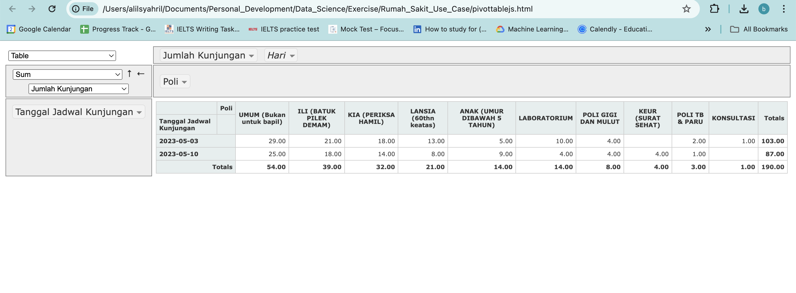
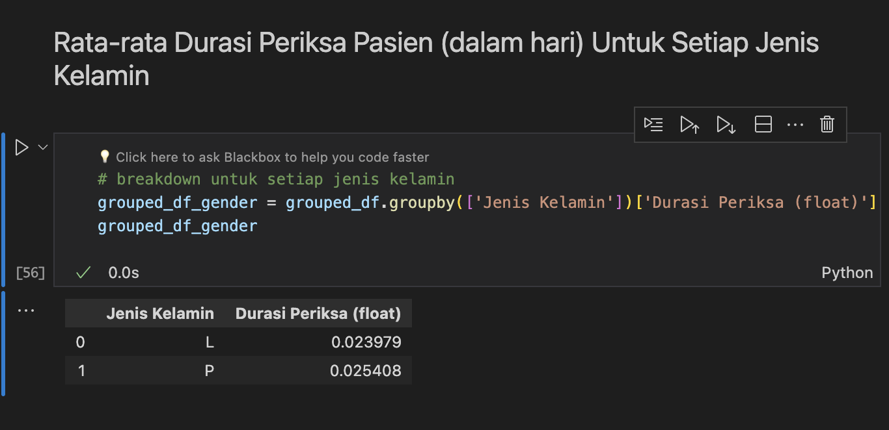
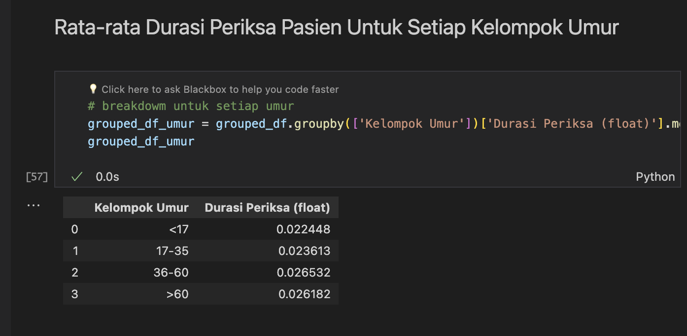
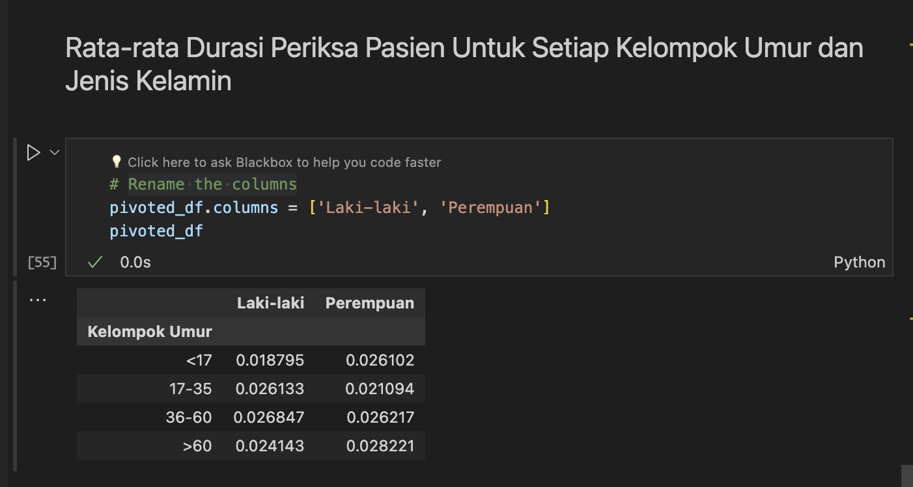

The code will generate a html file called 'pivottablejs.html' and you can edit the pivot table there. This is the example pivot table ouput for number of visits on each 'Tanggal Kunjungan' and 'Poli', but only on Wednesdays.

The Code also provides an analysis for the average duration of each patient and its demograpics tendency.

It can be seen that female patients tend to have a longer examination duration than male patients with an average examination duration of around 0.025 days or 36 minutes compared to men, around 0.023 days or 33 minutes.

It can be seen that patients in the age group 36-60 and >60 tend to have a longer examination duration than patients in other age groups with an average examination duration of around 0.026 days or 37.5 minutes. The age group <17 years tends to have a faster examination duration than other groups, namely around 0.022 days or 31.6 minutes.

If we look at the combination of age group and gender, we can see that male patients in the age group <17 years are the patients with the fastest examination duration, namely 0.018 days or only around 26 minutes. Meanwhile, the longest examination duration was for patients with female gender and age group >60 years with an average examination duration of 0.028 days or 40.3 minutes.
